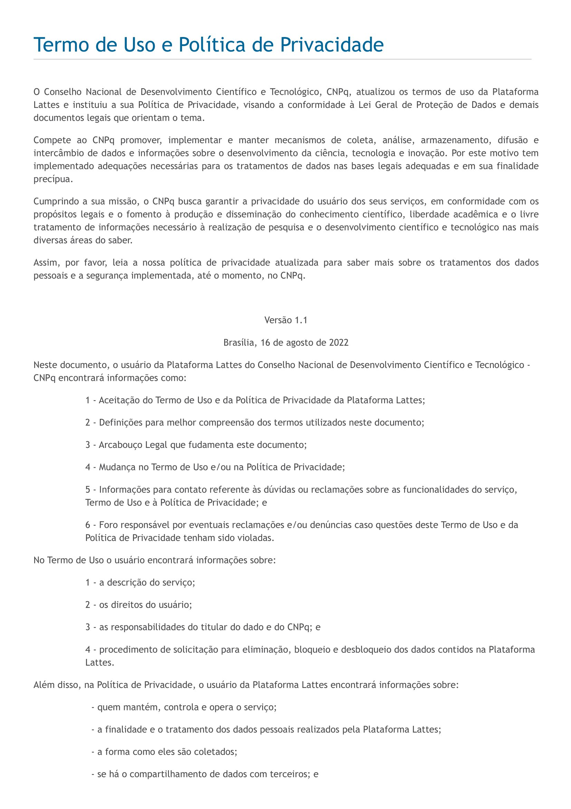
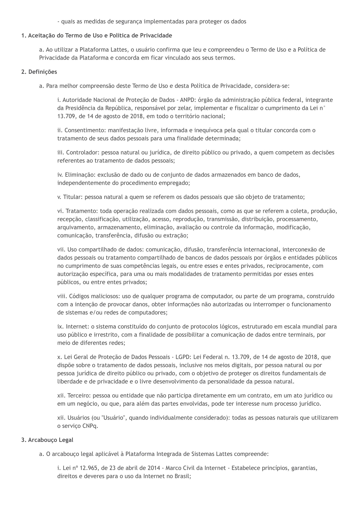
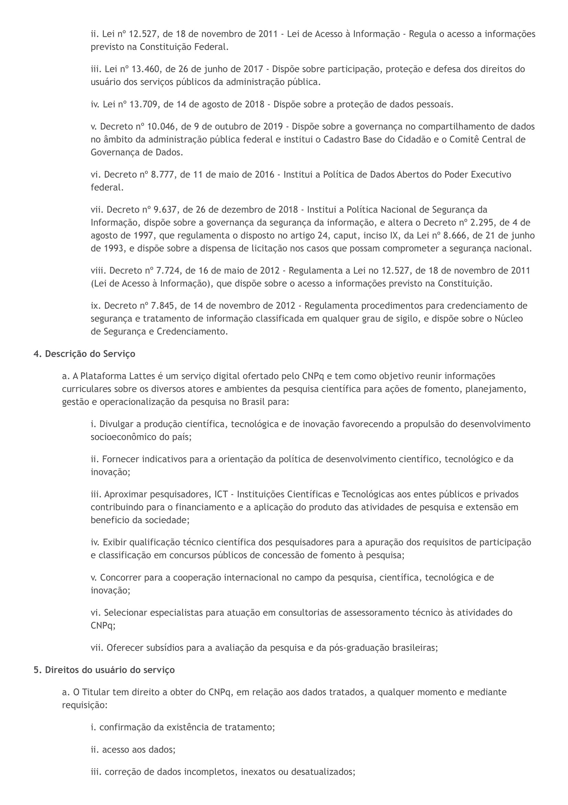
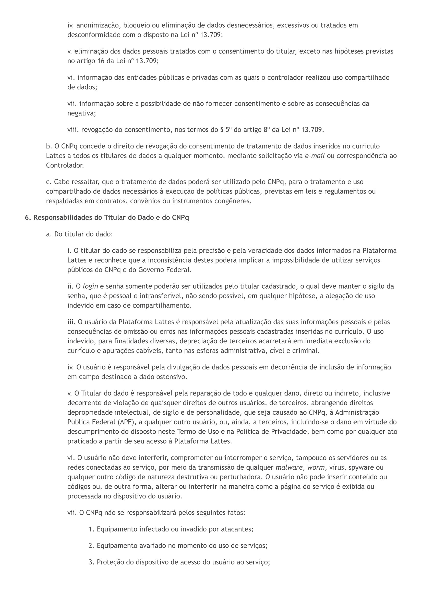
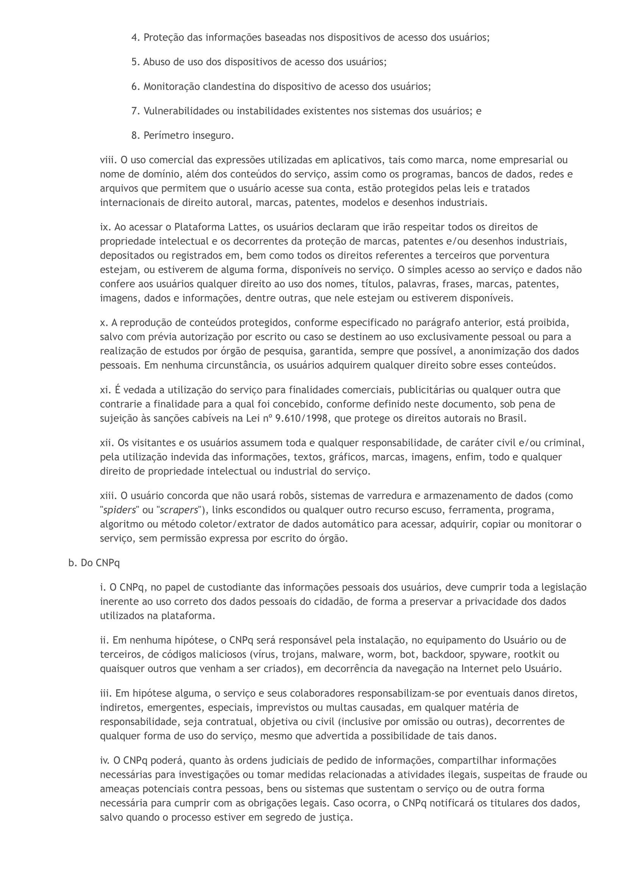
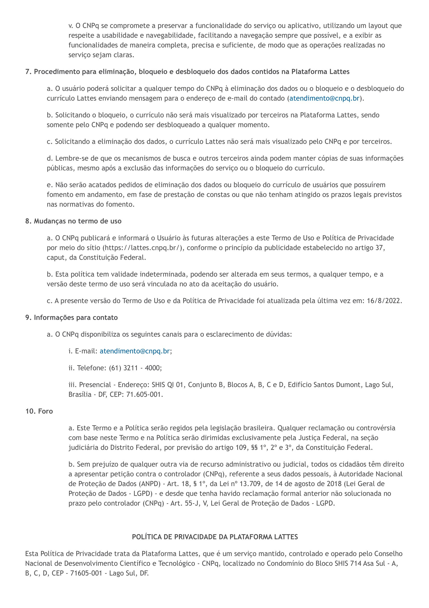
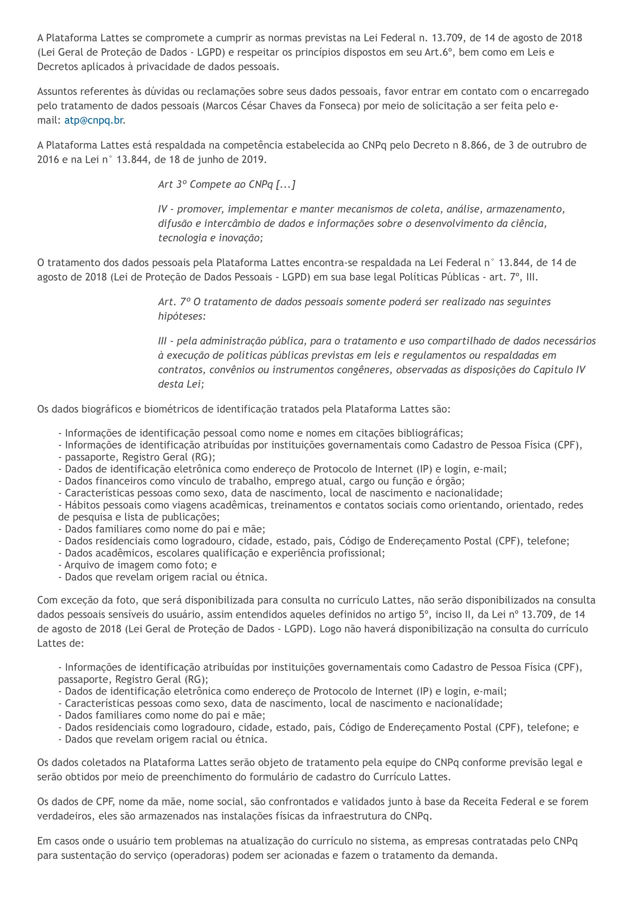
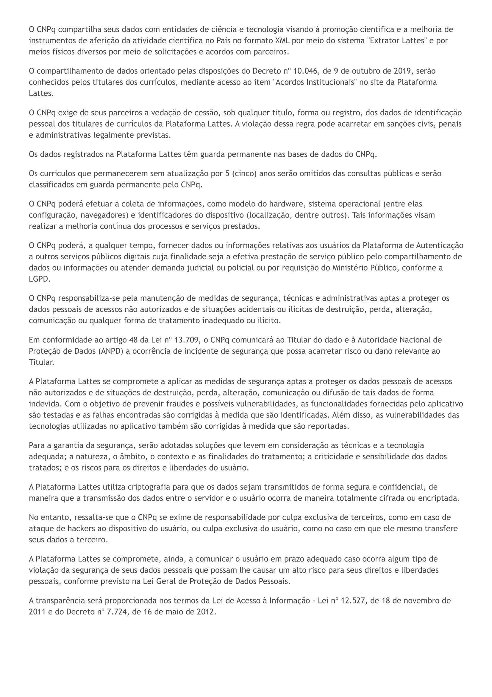

# **Termos de Uso - Plataforma Lattes **
## **Introdução**

Esse documento tem como objetivo documentar os [termos de uso](https://www.lattes.cnpq.br/) da aplicação web da plataforma Lattes do CNPq,escolhida para estudo e planejamento do projeto.

## **Termos de Uso e Política de Privacidade**

## **Conclusão**

A equipe responsável pelo planejamento do projeto garante que foi lido e que serão seguidos todos os termos de uso durante seu desenvolvimento, mantendo a conformidade com as políticas estabelecidas.

## **Fonte**

<a id="aa" href="#a">[1]</a> CNPq - Plataforma Lattes. Disponível em: https://www.lattes.cnpq.br/

#### **Histórico de Versões**

| Versão | Data       | Descrição            | Autor          | Revisor        |
|--------|------------|----------------------|----------------|--------------- |
| 1.0    | 28/09/2023 | Criação do documento e adição dos termos de uso   | [Joel Soares](https://github.com/JoelSRangel)|| 

